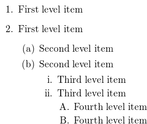

# Introduction to scientific working

## Environments in LaTeX

### Description Environments

Often it is necessary to define and explain words in a document.
For this LaTeX provides the `description` environment.

```Latex
\begin{description}
  \item[LaTeX] is a high-quality typesetting system;
    it includes features designed for the production
    of technical and scientific documentation.

  \item[Markdown] is two things: (1) a plain text formatting
    syntax; and (2) a software tool, written in Perl, that
    converts the plain text formatting to HTML.
\end{description}
```

The example above results in:

**LaTeX** is a high-quality typesetting system;
  it includes features designed for the production
  of technical and scientific documentation.

**Markdown** is two things: (1) a plain text formatting
  syntax; and (2) a software tool, written in Perl, that
  converts the plain text formatting to HTML.

### Lists

Writing about research or work often incorporates lists of options, words,
methods, objects and a lot of other stuff.

In LaTeX it is possible to structure them in lists independent of document
chapters or sections.

LaTeX provides **ordered** and **unordered** lists:

#### Ordered Lists

```Latex
\begin{enumerate}
  \item List item 1
  \item List item 2
  \item List item 3
\end{enumerate}
```

Results in:

1. List item 1
2. List item 2
3. List item 3

#### Unordered Lists

```Latex
\begin{itemize}
  \item List item 1
  \item List item 2
  \item List item 3
\end{itemize}
```

Results in:

- List item 1
- List item 2
- List item 3

#### Nested Lists

It is also possible to nest a list in an other list:

```Latex
\begin{enumerate}
   \item The labels consists of sequential numbers.
   \begin{itemize}
     \item The individual entries are indicated with a black dot, a so-called bullet.
     \item The text in the entries may be of any length.
   \end{itemize}
   \item The numbers starts at 1 with every call to the enumerate environment.
\end{enumerate}
```

Results in:

1. The labels consists of sequential numbers.
  - The individual entries are indicated with a black dot, a so-called bullet.
  - The text in the entrie may be of any length.
2. The numbers starts at 1 with every call to the enumerate environment.

##### Nested Lists and numbering

The following results in different numbers for the items, depending on the depth
of nesting.

```Latex
\begin{enumerate}
  \item First level item
  \item First level item
  \begin{enumerate}
    \item Second level item
    \item Second level item
    \begin{enumerate}
      \item Third level item
      \item Third level item
      \begin{enumerate}
        \item Fourth level item
        \item Fourth level item
      \end{enumerate}
    \end{enumerate}
  \end{enumerate}
\end{enumerate}
```



## Next:

[LaTeX Graphics](L12_LaTeX-Graphics.md)
