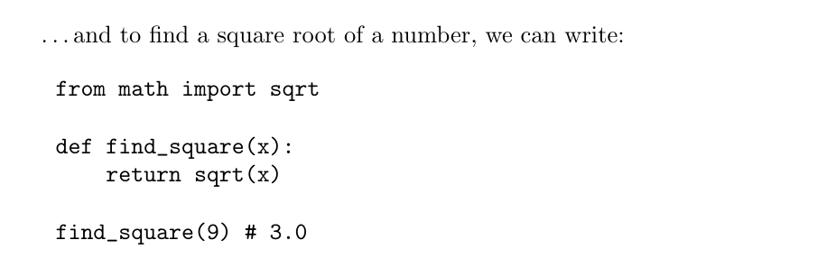
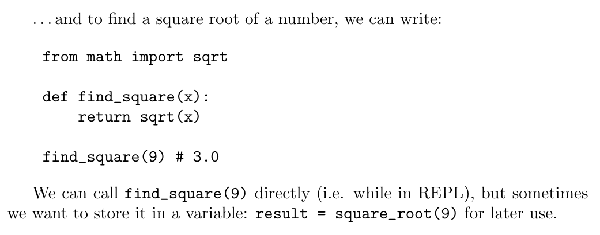
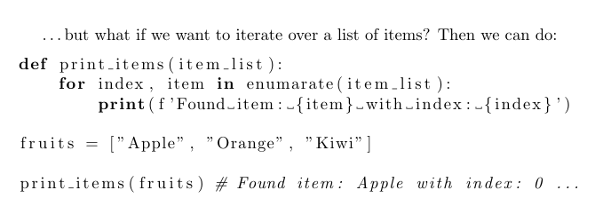
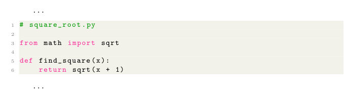

# Introduction to scientific working

## Representing code in LaTeX

If you are in STEM, you will probably want to represent code at some point in your papers.

Fortunately, LaTeX makes code formatting easy.

Let's see how to use the standard verbatim environment as well as the package listings, which provide more advanced code-formatting features.

The default tool to display code in LaTeX is `verbatim`, which generates an output in monospaced font. 

The most minimal formatting you can do is:

```latex
\documentclass{article}

\begin{document}

\dots
and to find a square root of a number, we can write:

\begin{verbatim}
    from math import sqrt

    def find_square(x):
        return sqrt(x)
    
    find_square(9) # 3.0
\end{verbatim}

\end{document}
```

Which would result in:



It's good to know that verbatim-like text can also be used in a paragraph by means of the `\verb` command. Appending:

```latex
We can call \verb|find_square(9)| directly (i.e. while in REPL), but sometimes we want to store it in a variable: \verb|result = square_root(9)| for later use. 
```

after the `\end{verbatim}` would result in:



### Using `listing` to highlight code

Sometimes we want to have our code highlighted, so we take advantage of the package `listings`. For example:

```latex
\documentclass{article}

\usepackage{listings}

\begin{document}

\dots
but what if we want to iterate over a list of items? Then we can do:

\begin{lstlisting}[language=Python]
def print_items(item_list):
    for index, item in enumerate(item_list):
        print(f'Found item: {item} with index: {index}')

fruits = ["Apple", "Orange", "Kiwi"]

print_items(fruits) # Found item: Apple with index: 0 ...
\end{lstlisting}

\end{document}

```

Would result in:



_Notice how some of the keywords (like `def`, `for` ...) are **bold**._

#### Importing code from a file

The package also allows you to read code from a file, instead of pasting it into your `.tex` file.

I.e. if we have a file `square_root.py`, which contains the following code:

```python
# square_root.py

from math import sqrt

def find_square(x):
    return sqrt(x)
```

What we can do here to pull the code is:

```latex
\lstinputlisting[language=Python]{./square_root.py}
```

_`./` indicates that the file is in the same directory as the `.tex` file._

#### What about code styles and colours?

You can do that as well! However, here we need to introduce another package, called `xcolor`.

What you can do is:

```latex
\documentclass{article}
\usepackage[utf8]{inputenc}

\usepackage{listings}
\usepackage{xcolor}

\definecolor{codegreen}{rgb}{0,0.6,0}
\definecolor{codegray}{rgb}{0.5,0.5,0.5}
\definecolor{codepurple}{rgb}{0.58,0,0.82}
\definecolor{backcolour}{rgb}{0.95,0.95,0.92}

\lstdefinestyle{mystyle}{
    backgroundcolor=\color{backcolour},   
    commentstyle=\color{codegreen},
    keywordstyle=\color{magenta},
    numberstyle=\tiny\color{codegray},
    stringstyle=\color{codepurple},
    basicstyle=\ttfamily\footnotesize,
    numbers=left,                    
    numbersep=5pt,                  
}

\lstset{style=mystyle}

\begin{document}

\dots 

\lstinputlisting[language=Python]{./square_root.py}

\dots
\end{document}
```

Which would result in:



You can notice the variables used in `\lstdefinestyle{mystyle}`. The block of code is generated depending on the value of these variables. Read the [docs](http://texdoc.net/texmf-dist/doc/latex/listings/listings.pdf) on `listings` to see what else you can use!

**NOTE:** There is another package called `minted`, which is more powerful package that allows formatting and highlighting source code. I strongly recommend checking it out.

## Next:

_To be added_.

